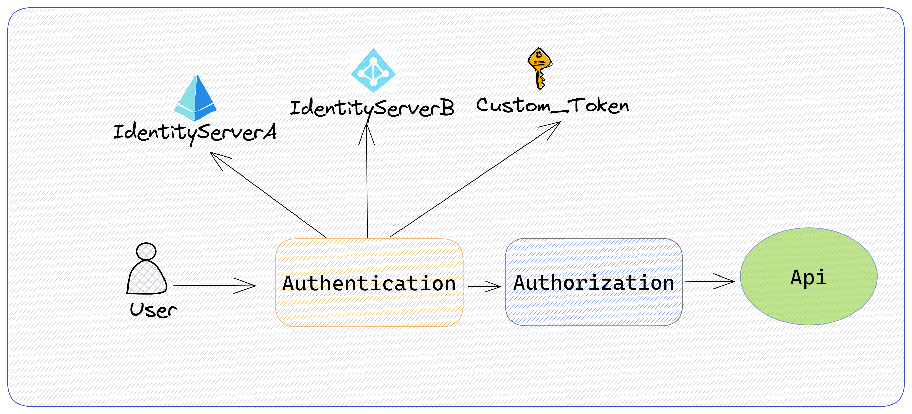

# Asp.net: Multiple Authentication Schemes

A sample project to show how we can add multiple authentication schemes.

In this project I try to add 3 authentication schemes:
- **IdentityServerA (like Azure AD)**
- **IdentityServerB (like Azure AD B2C)**
- **Custom Token (internal token in your app)**

